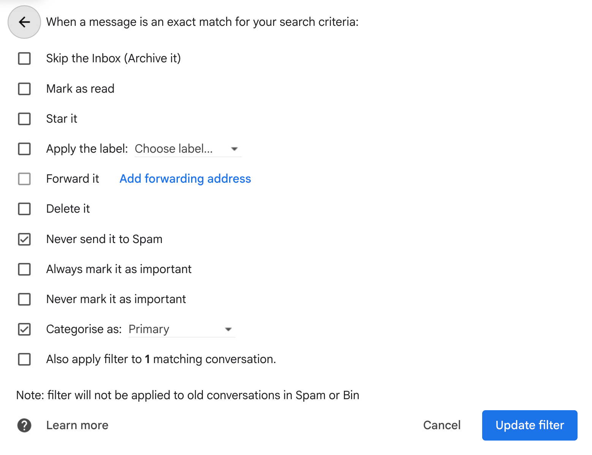

## How to Make Sure You Receive Our Emails

### For Outlook 
Link(https://support.microsoft.com/en-us/office/add-recipients-to-the-safe-senders-list-in-outlook-be1baea0-beab-4a30-b968-9004332336ce) to instructions on allowing jhfseminar@226984014.mailchimpapp.com through your inbox filters.

### For Gmail
Link(https://downtimemonkey.com/blog/how-to-whitelist-an-email-address-in-gmail.php) on how to whitelist our emails. We also recommend selecting "Categorize as: Primary" in addition to "Never send to Spam" to prevent our emails from landing in your Promotions tab. (See reference image below.)

